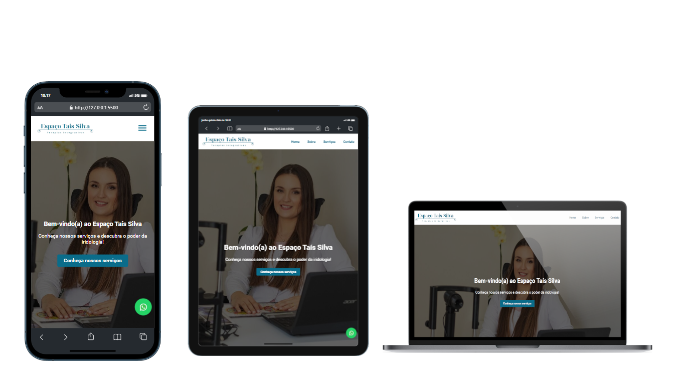

<h1 align="center"> Reestruturação do projeto - Espaco Tais Silva</h1>

  <a href="#-tecnologias">Tecnologias</a>&nbsp;&nbsp;&nbsp;|&nbsp;&nbsp;&nbsp;
  <a href="#-projeto">Projeto</a>&nbsp;&nbsp;&nbsp;|&nbsp;&nbsp;&nbsp;
  <a href="#-layout">Layout</a>&nbsp;&nbsp;&nbsp;&nbsp;&nbsp;&nbsp;

  <h3 align="center">Layout Original</h3> 
    

  <h3 align="center">Layout Corrigido</h3> 
    

  <h3 align="center">Layout Responsivo</h3>
  

## 🚀 Tecnologias

Esse projeto foi desenvolvido com as seguintes tecnologias:

- HTML5 
- CSS3
- JS

## 💻 Projeto

A minha tarefa consistiu em reformular o código HTML e CSS existente, assim como incorporar novas funcionalidades através do uso de JavaScript. Um exemplo disso é a implementação do menu mobile, aprimorando a estética, usabilidade e funcionalidade do website. O objetivo foi proporcionar aos utilizadores uma experiência de navegação e interação melhorada tanto em dispositivos móveis como em computadores.

## 🔖 Deployment

Você pode visualizar os deploys dos projetos através desses links:
 🟢[Vercel](https://iridologia-seven.vercel.app/) (Minhas alterações).
 🟢[Site original](https://www.taisiridologista.com.br/) (Particularidades da equipe Meet Developers).

---

Ideia desenvolvida por [Meet Developers](https://www.meetdevelopers.com.br/).
